<h1 class="title" align="center" >mybatis-generator-plus</h1>

<!---

--->

#介绍

mybatis-generator-plus是一个基于mybatis的官方代码生成工具mybatis generator进行改造的可视化代码idea插件，此插件只是一个辅助工具对原生的mybatis无任何倾入，理论上可以支持所有的关系型数据库，目前测试的数据库：mysql,mariadb。  
注：欢迎测试其他类型数据库，如有问题可联系

#安装
__在线安装：__   测试完成后上传到idea插件仓库
__离线安装：__   测试完成后在github上传release离线安装包

#概念
__数据源：__  数据库的连接信息，插件会根据选择的数据源信息进行对应库的表映射，一个project只维护一份数据源
__实体组：__ 用来限定实体的范围，一个组代表一个模块下的唯一路径，在同一个组下的实体不能重名
__表实体：__  数据库表对应的实体
__查询实体：__ 查询语句对应的实体
#使用
##初始化
在使用插件进行代码生成前需要先初始化才能被插件识别。初始化操作如下:

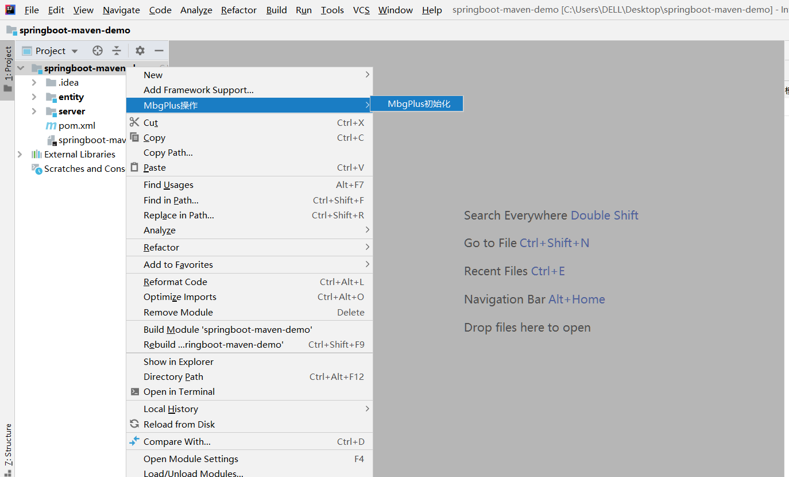  

注：同一个project下需要被插件管理的module都需要单独初始化
##数据源
初始化之后需要先配置数据源，数据源在配置实体组信息的时候需要被选择，数据源的添加/修改需要在根目录下操作
###添加数据源：
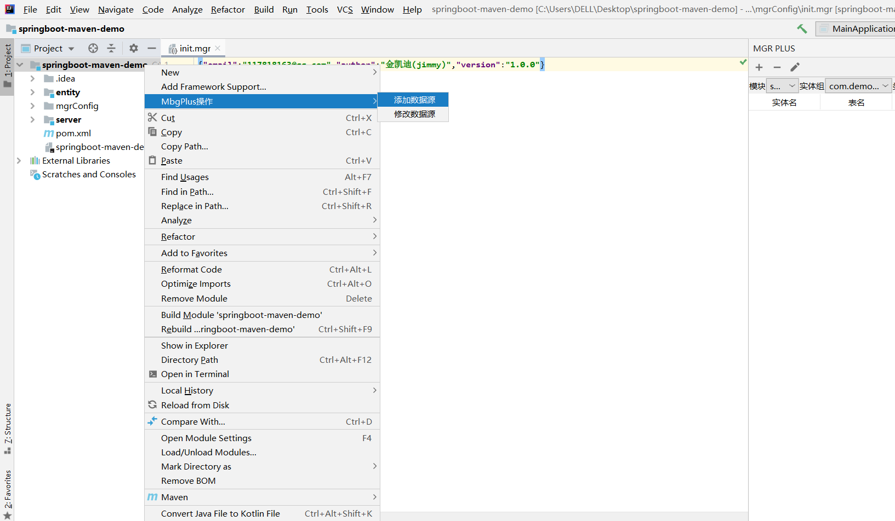  
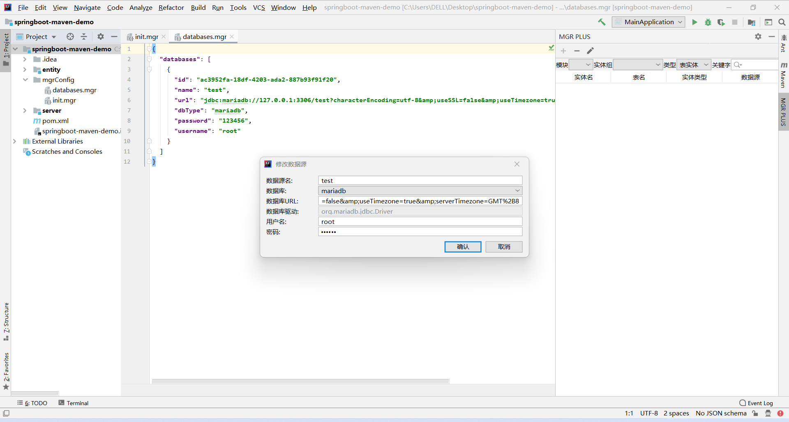 
其中数据源名需要唯一
###修改数据源：
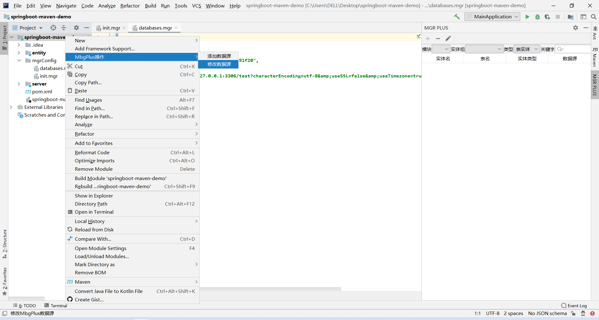 
 
##实体组
###属性介绍
所属模块：当前实体组所在的module
数据源：当前实体组下实体对应的数据库信息
实体组路径：实体组对应的唯一包路径
实体路径：表/查询实体生成的对应路径
Mapper路径：Mapper接口类生成的对应路径
DTO所属模块：默认是当前module，可以选择跟当前module同级并且未被插件初始化的module,被选择后的module无法在被插件管理。
DTO路径：DTO实体生成的对应路径
###添加
实体组是一堆表实体和查询实体的集合，代表一个package路径可以在任何已经初始化过的idea module下进行创建
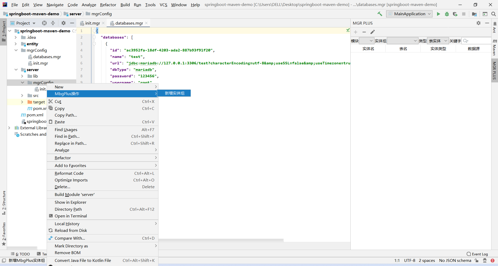 
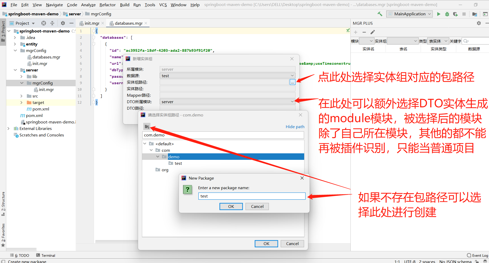
###修改
目前暂不支持修改实体组路径信息，如想修改可自己进行手动修改并按规则修改对应的文件
##实体
###属性介绍
所属模块：实体对应的module
数据库：实体组选择的数据源
实体名：实体对应的class类名
所属组：实体名对应的实体组
数据库：实体映射的数据库表
字段自定义配置：用来配置数据表的字段的自定义配置(目前只有添加进列表生成Example where条件方法的功能)
###添加实体
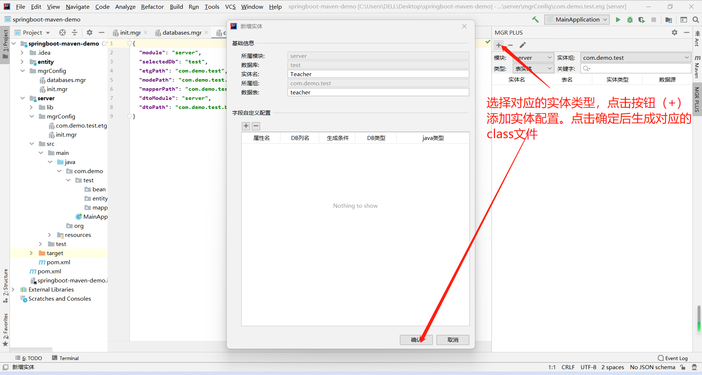 
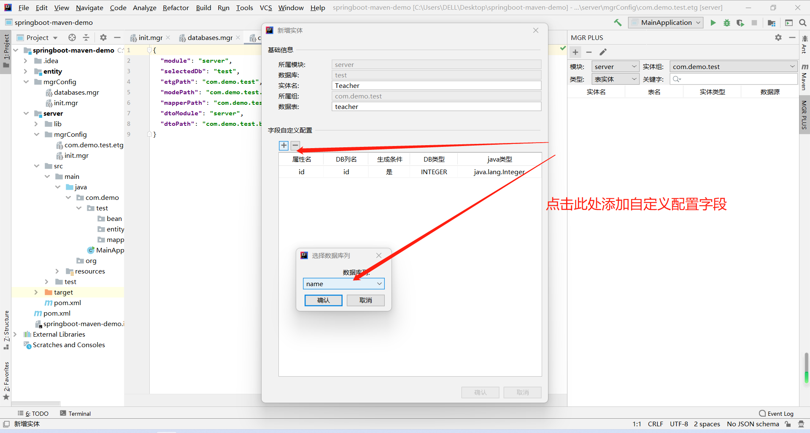 
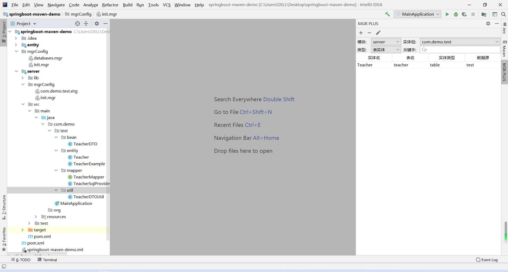 
###修改实体
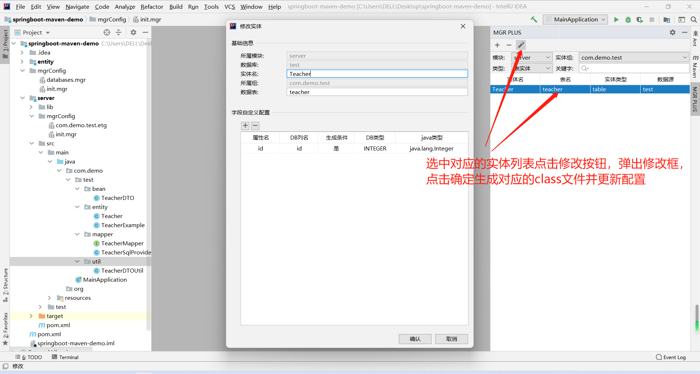 
###删除实体
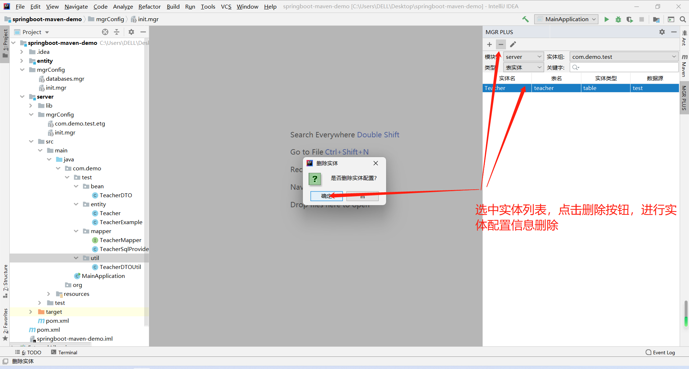 
#其他功能
待续

